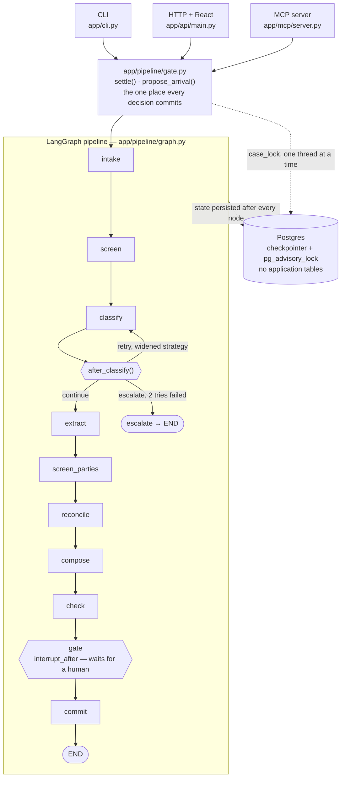

# doctask — an agentic system for a pile of documents that never quite agree

Reads a pile of vendor due-diligence documents, produces a register where every
claim points back to the exact words it came from, checks that register against
a rulebook supplied as data, and keeps both current as new documents arrive —
with a human approving every consequential decision before it commits.

## Run it

```bash
docker compose up --build
```

That starts Postgres, seeds the synthetic corpora, builds the
review interface, and runs the full verification — which exercises every claim
below and prints the gaps that remain. Nothing else to install, no Node needed,
and **no API key is needed for any of it**.

The verifier prints its result and exits. The review interface stays up at

**http://localhost:8000**

Pick a pile, run it, and settle each item. Or drive the same operations from
the command line (`python -m app.cli run meridian`) or over MCP — they are the
same graph and the same decisions, so a decision settled in the browser is
indistinguishable from one settled by an agent.

<details>
<summary>Without Docker</summary>

```bash
make native-setup                                  # venv + dependencies + corpora
export DATABASE_URL=postgresql://user:pw@localhost:5432/doctask
make native-verify
```

Requires a Postgres. No extensions are needed — see the note on vector search
below.
</details>

## The domain, and why this one

Vendor onboarding due diligence: incorporation records, ownership disclosures,
sanctions screening results, invoices, contract amendments.

I spent roughly two and a half years at Amazon screening seller registrations
against sanctions and PEP watchlist data, adjudicating true and false positive
matches under written procedure, and keeping the trail audit-ready. The three
movements of this system are the shape of that job, so the design decisions are
ones I can defend from having done the work rather than from having read about
it.

**Everything bundled here is invented.** Every vendor, beneficial owner, bank
account, contract, invoice and screening result in `corpora/` is fabricated, and
so is every party on the watchlist in `watchlists/` — every company, every
natural person, every passport number and date of birth, published by a
sanctioning body that does not exist. Any resemblance to a real listed party is
accidental.

That is a change from an earlier version of this repository, which shipped a
real extract of the OFAC SDN list. The brief asks for invented data — *"Where
your build needs a client, a company, or data, invent them"* — and a system
whose central claim is that it never bluffs should not need a footnote
explaining which of its own statements to discount.
[`scripts/curate_watchlist.py`](scripts/curate_watchlist.py) still builds the
identical schema from the genuine Treasury file for anyone who wants to point
this at the real list. That path is opt-in and nothing in the default
configuration touches it.

## What it does

**Understands the pile.** Reads `.txt`, `.md`, `.html`/`.htm`, `.docx` and
`.pdf` into one normalised text, splits it into paragraph-level chunks with
exact character offsets, identifies each document, and extracts facts. Produces
a **Vendor Due-Diligence Register** in five sections where every line traces to
a source span you can re-slice and check.

**Examines.** Rules live in [`checklists/vendor_onboarding_v1.yaml`](checklists/vendor_onboarding_v1.yaml)
— twelve rules across five stages, as data. Adding a rule, changing a threshold
or supporting a new jurisdiction is an edit to that file. Only a genuinely new
*kind* of check touches Python.

**Screens the parties itself.** The vendor and its beneficial owner are matched
against the bundled watchlist, and every alert
reaches a human with the full per-identifier comparison behind it. Costs zero
model calls — a sanctions decision has to be explainable to a regulator line by
line, and an LLM asked "is this the same company" gives a confident answer with
no auditable basis.

**Stays alive.** A new document rebuilds only the sections it could have
affected, and proves the rest are byte-identical. A full run costs 14 model
calls; an arrival costs 2.

## Architecture

Three surfaces drive the same operations against the same graph. None of them
contain logic of their own — every one of them calls into `gate.py`, so a
decision made by a person clicking a button and a decision made by an MCP
client calling a tool go through the identical code path and land the same
way.



What this is saying, node by node:

- **`classify` can take three different paths**, not just pass or fail — a
  document with the usual header phrases stripped out retries once with a
  widened strategy, and only escalates to a human if it *still* can't be
  identified. That's the "decisions change the path" requirement, not a
  euphemism for it.
- **`gate` is where the graph stops**, not a UI screen that happens to sit in
  front of it. `interrupt_after=["gate"]` is a LangGraph primitive: the run
  physically cannot reach `commit` until every pending `Decision` in state has
  been settled, on any surface. That's the human-in-the-loop requirement
  enforced by the framework, not by convention.
- **Postgres appears twice and does two jobs, both narrow.** It's the
  LangGraph checkpointer (so a killed process resumes from its last completed
  node, not from scratch) and it holds one advisory lock per case thread (so
  two reviewers hitting the same case, or the same pile run twice, can't
  interleave writes). There is no application table — no `documents` table, no
  `claims` table. The graph's own state *is* the database.
- **An arrival (a new document landing mid-case) re-enters at `propose_arrival`
  in the same `gate.py`**, not a separate code path — it proposes a focused
  update, which becomes a `Decision` like any other, subject to the same gate.

## The ten behaviours, and where to check each

| # | Behaviour | Where it is proven |
|---|---|---|
| 1 | Stages whose decisions change the path | `tests/test_branching.py` — retry uses a *different* strategy, then escalates |
| 2 | Survives being stopped | `tests/test_resilience.py::test_killed_run_resumes_without_repeating_work` |
| 3 | A human holds the gate, item by item | `tests/test_gate.py`, `tests/test_arrival_gate.py` — commit is refused while anything is unreviewed |
| 4 | A machine can drive it | `scripts/drive_via_mcp.py` — including approval |
| 5 | Never bluffs | `tests/test_provenance.py` — enforced by the type system; click any register line in the UI to re-slice its source |
| 6 | A stranger can run it | this file, `docker compose up --build` |
| 7 | Proves itself without a key | `make test` — 138 tests, no key |
| 8 | Takes no orders from documents | `tests/test_injection.py` |
| 9 | Concurrency does not corrupt | `tests/test_resilience.py` |
| 10 | Knows what it cost | any run prints a per-stage ledger |

## Sanctions screening, and the third answer

I spent about two and a half years adjudicating watchlist alerts. The single
most consequential thing I learned is that an analyst needs **three** answers,
not two, and most systems only offer two.

| Outcome | What the analyst is saying |
|---|---|
| **True match** | This is them. Confirmed on name plus a corroborating identifier. |
| **False positive** | This is not them, and here is the strong factor that differs. |
| **Escalate (abundance of caution)** | I looked, and I cannot clear it on the evidence available. |

The third one is the whole point. A partial name match with nothing available
to discount it on is not a false positive — it is an unanswered question, and
filing it as cleared because the discounting fields happened to be empty is how
real breaches happen. **Absent evidence is not evidence of difference.** So
`UNAVAILABLE` is a distinct comparison result from `MISMATCH`, it carries no
discounting weight, and an alert with nothing to discount it on escalates and
**blocks onboarding** rather than passing quietly.

That is the same principle as `NOT_EVALUATED` in the checklist engine, applied
to a place where getting it wrong is a regulatory breach rather than a bug
report.

**The engine never clears an alert.** It scores the name, compares every
identifier it can, and offers a recommendation with its reasoning. A human
settles it. `SCR-004` then reports the outcome honestly: an alert nobody has
looked at yet is `NOT_EVALUATED`, not a pass.

**The list is invented; its shape is not.** `watchlists/synthetic_consolidated.json`
holds 23 fabricated entries built by
[`scripts/make_watchlist.py`](scripts/make_watchlist.py), chosen for the cases
they teach: collisions with the synthetic vendors, listed natural persons for
UBO screening, and the short generic aliases the Wolfsberg guidance names as
the main source of false positives. The schema, the semicolon-delimited remarks
field, the `a.k.a.` markers and the programme codes are modelled on how real
consolidated lists publish — so the matcher is exercised against the shape real
data arrives in, not a convenient one. Secondary identifiers are parsed out of
free text for the same reason: a real list buries date of birth and passport
number in prose, and an engine that cannot read them screens on names alone.

The adjudication logic follows published standards — Wolfsberg Group
*Sanctions Screening Guidance*, the FFIEC BSA/AML Examination Manual's OFAC
section, and OFAC's *Framework for Compliance Commitments* — not any employer's
internal procedure.

**Identity documents, and why there is no face matching.** A passport or
national ID is a document kind like any other: it is classified, and its date
of birth, nationality and document number are extracted as cited claims and fed
to the screening engine as secondary identifiers. Which identifiers apply
depends on the party — comparing a company's incorporation date against a
person's date of birth is nonsense, and padding an alert with fields that can
never apply makes it look better evidenced than it is.

The `identified` pile demonstrates what this is worth, and the demonstration is
a counterfactual. Its beneficial owner shares a name with a listed individual on
the bundled watchlist — a **100% name match**, the strongest possible. Both
people are invented; that is the point, and it is why the collision can be
staged exactly rather than approximately.

| | Verdict |
|---|---|
| Screened on the name alone | **Escalate.** Nothing available to discount it with. |
| With the passport in the pile | **False positive.** Date of birth and document number both differ. |

Same subject, same listing, same score. The only difference is one document.
And what changed the verdict was the *fields printed on it*, not the
photograph — which is the argument against face matching. A biometric
comparison would add a large dependency, a new class of error, and no
adjudicative value the fields do not already carry. (`scripts/verify_all.sh`
runs both halves of that table.)

## Four decisions worth arguing about

**Provenance is a type invariant, not a convention.** A `Claim` marked
supported raises at construction if it carries no citation, and an unsupported
claim raises if it carries a value. The system cannot bluff because the shape
of the data will not let it.

**The offline model adapter does real extraction.** The brief asks for tests
that run without a key *and* warns that tests proving only your mocks work do
not count. Those pull against each other unless the offline path does something
real — so it performs genuine deterministic extraction returning real character
spans. Every stage below inference runs identical code either way.

**Three outcomes, not two.** A rule whose evidence is missing reports
`NOT_EVALUATED`, never `PASSED`. *"No findings, but one rule could not be
evaluated"* is a different sentence from *"no findings, every rule ran and
passed"*, and they are reported differently. A check that quietly passes when
it could not run is worse than no check.

**A retry must change strategy.** Repeating an identical deterministic call
returns an identical answer. The second classification attempt reads the
filename and accepts weaker evidence; the live adapter re-prompts, naming the
filename as evidence. Those widened cues are deliberately kept out of the first
pass, where they would mislabel documents the content patterns get right.

## Piles

| Pile | What it is for |
|---|---|
| `meridian` | Deliberate defects: an ownership conflict (62% vs 41%), an open screening alert, an invoice exceeding its contract, and a document that tries to give the system orders |
| `northwind` | The control. Nothing is wrong with it, and the system must be capable of saying so |
| `identified` | A beneficial owner who matches a listed individual 100% by name, plus the passport that clears him. Remove the passport and the same alert escalates |
| `ambiguous` | Bodies stripped of the usual phrases, filenames intact — the first pass fails, the widened retry recovers |
| `unidentifiable` | Neither pass can identify it, so the run halts and asks for a human |
| `_arrivals` | Documents dropped in later, to exercise focused updates |

## Bring your own case

The five bundled piles exist so a stranger can run something in minutes with
no setup. They are not the only way to use this. "Your own case" in the
sidebar (or `POST /api/piles`) takes real files and runs the identical
pipeline against them — the brief's "second run, different documents" test.

A vendor package is usually an incorporation certificate, an ownership
disclosure, a screening result, a contract, an invoice and bank details — all
about the *same* invented vendor. Fewer documents is fine: rules whose
evidence is missing report `not evaluated` rather than passing, which is the
honest answer, not a bug. Accepted formats: `.txt .md .html .htm .docx .pdf`.
Invent the vendor; nothing real belongs in this repository.

Would rather not invent one from scratch: `sample-vendor-package/` has a
ready-made six-document set (a clean vendor with exactly one planted issue —
an invoice above its contract value) for exactly this. Download it, pick
**Upload yours**, and in the file picker **select all six files at once**
(shift-click or Cmd/Ctrl+A across them) before confirming. The picker replaces
your selection each time it opens rather than adding to it, so choosing them
one dialog at a time leaves only the last file selected, not all six.

A case created this way gets the same arrivals capability the bundled
`meridian` demo does: upload a late document against it (sidebar, or `POST
/api/runs/{thread}/arrivals/upload`) and it proposes a focused update the same
way — scoped to that case only, never offered to or applicable against a
different pile.

## Commands

```bash
make up             # everything, then the full verification
make test           # test suite only
make demo           # walk one pile to the gate, interactively
make mcp            # MCP server over stdio
make shell          # a shell in the container
make clean          # stop and delete the database volume
```

Direct CLI, inside the container or a native venv:

```bash
python -m app.cli run     meridian --thread demo
python -m app.cli pending demo
python -m app.cli approve demo 0 --value "41%" --note "amended disclosure supersedes"
python -m app.cli reject  demo 3 --note "amendment raises the contract value"
python -m app.cli resume  demo
python -m app.cli report  demo
```

## Known limitations

Stated because a build with no admitted limits has not been looked at hard
enough.

- **Cost reporting has never been exercised against a live model.** The ledger
  meters calls, tokens and wall time correctly, but the offline adapter is
  free, so the spend column has only ever read `$0.00`.
- **There is no filesystem watcher.** Arrivals are applied by an explicit call
  (`apply_new_document`), not by a process watching a directory. The focused
  update itself is real; the trigger is manual.
- **There is no vector search, and that is a deliberate departure from the
  stated stack.** The brief names PostgreSQL with vector search. This build
  uses Postgres only as the LangGraph checkpoint store, and does not create the
  `vector` extension at all.

  The register is assembled from *named structured attributes* —
  `registered_name`, `ubo_percentage`, `contract_value`. For those, an exact
  match is the correct comparison and semantic similarity is the wrong one: it
  would manufacture conflicts between values that merely read alike, inside a
  document whose entire purpose is to record what the sources actually say. An
  embedding model would also have to be stubbed to keep the suite runnable
  without a key, and a stubbed embedder proves nothing about retrieval quality.

  An earlier version created the extension anyway and used nothing. Provisioning
  infrastructure for a capability the system does not have is the same class of
  claim as a success message that is not true, so it is gone. If the domain grew
  to free-text sources — adverse-media articles, filings, correspondence — this
  is the first thing I would add, and `pgvector` is what I would add.
- **Screening covers one bundled list.** No second list, no PEP source, no
  adverse media. Adding one is a data change — the loader reads entries and
  nothing in the matcher knows where they came from — but it has not been done,
  so alert recall is bounded by that list.
- **The live model path has never been run.** Every test uses the offline
  adapter. `AnthropicAdapter` is written and exercised by nothing, so it is the
  least proven code in the repository. Everything below inference is identical
  on both paths, which is the point of the adapter, but that is an argument
  about design rather than evidence about behaviour.
- **Documents longer than the per-call limit are read in part.** 6,000
  characters for classification, 20,000 for extraction, both configurable. When
  it bites, the run reports `chars_not_read` on the extract stage rather than
  passing the shortfall off as an absent attribute — but the tail is still
  unread, and a long contract would need chunked extraction to be handled
  properly.
- **Only one focused update is ever computed at a time.** A second arrival
  cannot be computed while one awaits review — it would be reasoned about
  against a register the first may still change. It used to be refused
  outright; it now queues (visibly, in `pending_arrivals`) and becomes
  computable the moment the outstanding one is settled, by resubmitting the
  same path. It is not auto-advanced: that would mean teaching `settle()` —
  the one function every decision on every surface goes through — about
  arrivals specifically, for a queue that is rarely more than one or two
  files deep. A reviewer re-submitting once is the cheaper cost.
- **The reviewer's name is self-asserted.** A decision records who settled it,
  when, and why — but there is no authentication, so the name is whatever the
  reviewer typed. Unverified is not the same as absent, and the audit trail is
  worth having either way; a real deployment would put an identity provider in
  front of it. There is also no retention policy.
- **Name matching is token-based, not phonetic.** It handles legal-form and
  punctuation variation and catches partial matches, but a transliteration
  variant that shares no tokens with the listing would be missed. Real
  screening vendors run phonetic and edit-distance passes as well.
- **The offline extractor is pattern-based**, so it handles the phrasings in
  these corpora and would need widening for messier real-world documents. That
  is the honest trade for a test suite that runs without a key.
- **Classification tolerance is a single global threshold** (34% unknown). A
  larger deployment would want it per-pile.

## Layout

```
app/core/       configuration, model adapters, injection screening, locks
app/domain/     the domain model and the rules engine
app/pipeline/   ingest, extraction, the agent graph, focused updates
app/mcp/        MCP server — the machine interface, including approval
app/api/        FastAPI HTTP layer, and it serves the built UI from one origin
ui/             React review interface
watchlists/     the synthetic sanctions list, with its provenance
checklists/     rules as data
corpora/        synthetic piles (see scripts/make_corpora.py)
tests/          the proof suite
scripts/        verification, corpus generation, the MCP driver
```

`TASK.md` describes how to work in this repository. `PROGRESS.md` logs the
assumptions made along the way and why.
